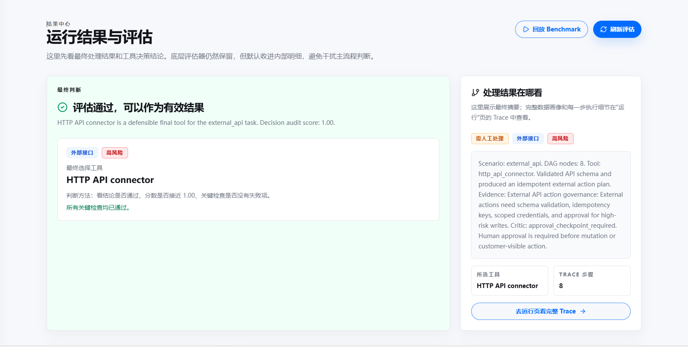
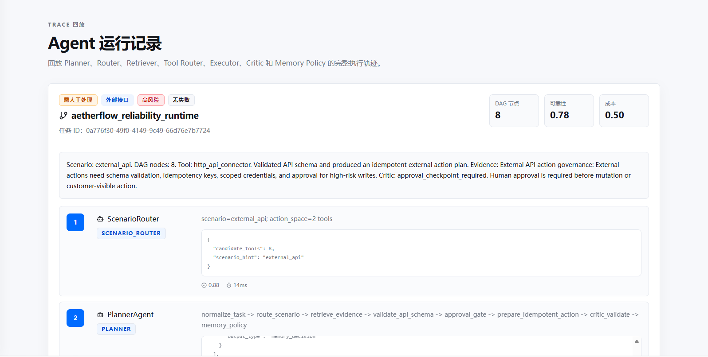
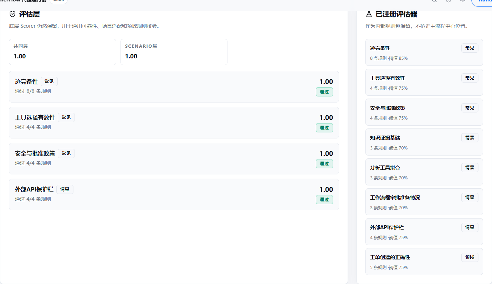
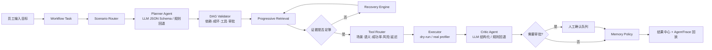

# AetherFlow

## Enterprise Agent Orchestration & Reliability Platform

面向企业员工的智能任务编排与可靠性运行平台。

[](backend/)
[](frontend/)
[](backend/app/agent/benchmarks/)
[](LICENSE)

AetherFlow 将员工的自然语言目标转化为可审计的 Workflow Task，并经过场景路由、结构化规划、证据检索、工具选择、风险校验和结果回放。高风险操作默认只生成 dry-run 方案，必须经过人工审批后才能进入后续流程。

项目重点不是“让模型多说一句答案”，而是把 Agent 的决策过程变成一条可验证、可恢复、可评估的企业任务执行链路。

> 当前仓库是可运行的工程原型：规则模式无需 LLM API Key 即可演示，配置模型后可启用结构化 Planner/Critic；外部 API 和代码执行默认保持 dry-run，不伪装成已经接入生产系统。

## 解决的问题

企业员工的真实任务通常同时包含资料、数据、流程和外部系统操作。单纯的聊天机器人很难回答以下问题：

- 当前任务属于知识查询、流程推进、代码、数据分析还是外部接口操作？
- 为什么选择这个工具，证据是否足够，结果能否复核？
- 任务涉及高风险动作时，是否必须由人确认？
- 一次失败发生在哪个阶段，能否恢复并保留完整审计记录？

AetherFlow 将这些判断拆成 Runtime 的显式阶段，并将每个阶段保存为 `AgentTraceStep`。

## 产品界面

### 员工任务结果

员工提交目标后，结果中心优先展示最终判断、选定工具、风险和下一步动作；工程细节可以继续进入 Trace 查看。



### AgentTrace 回放

每次运行都可以回放 Scenario Router、Planner、Retriever、Tool Router、Executor、Critic 和 Memory Policy 等阶段。



### 可靠性评估

评估页聚合场景路由、工具选择、审批策略、证据基础和输出契约，失败样本可以继续回到运行记录复盘。



## 核心流程



## 已落地能力

| 模块 | 面向用户的价值 | 工程实现 |
| --- | --- | --- |
| 员工工作台 | 直接描述工作，不需要先理解工具 | 中文界面、中文/英文输入、任务即时运行 |
| 运行治理 | 重试不制造重复运行，高风险任务可回到主流程 | Runtime 版本标识、`Idempotency-Key`、审批状态机、审批 Trace |
| Scenario Routing | 将任务映射到正确处理空间 | `knowledge`、`workflow`、`code`、`analysis`、`external_api`、`general` |
| Planner Agent | 将目标拆成可执行步骤 | LLM 结构化 DAG，JSON Schema 校验，失败重试和格式修复，规则规划器回退 |
| DAG Validator | 阻止不完整或不安全的计划进入执行 | 未知依赖、成环、未注册工具、缺失检索、缺失审批关卡检查 |
| Progressive Retrieval | 让结果有依据 | 先实体/段落，再补充文档和运行手册，证据不足进入恢复路径 |
| Tool Router | 在多个候选工具中给出可解释选择 | 场景匹配、关键词匹配、工具成功率、风险和延迟综合打分 |
| `data_frame_profiler` | 真正处理一份 CSV，而不是只返回模拟文本 | 字段数量、缺失值、数值统计、分类统计、重复/离群/类别失衡提示 |
| Critic Agent | 在结果交付前做安全和完整性审核 | 证据覆盖率、幻觉风险、工具风险、审批需求，支持 LLM 与规则双模式 |
| Memory Policy | 控制哪些结果值得沉淀 | 依据置信度和证据质量决定短期/长期记忆 |
| Trace 回放 | 能解释一次运行到底发生了什么 | Scenario、Planner、Retriever、Tool Router、Executor、Critic、Memory 全链路记录 |
| Reliability Evaluation | 用真实 benchmark 判断版本是否可放行 | 10 条 sample benchmark、Tool Top@K、场景准确率、审批准确率、Trace 完整性、输出契约和 Release Gate |

## 主要代码

```text
backend/app/
├── api/routes/
│   ├── agent.py             # Agent 运行、Trace、审批和单次评估 API
│   ├── workflow_tasks.py    # Workflow Task 创建、查询和更新
│   └── operations.py        # 企业运行概览和审批队列 API
├── agent/
│   ├── runtime.py           # Runtime 主编排和 AgentRun/Trace 落库
│   ├── planner.py           # LLM/规则双模 DAG Planner
│   ├── validators.py        # DAG、工具、检索和审批校验
│   ├── retrieval.py         # Progressive Retrieval 和证据包
│   ├── tool_registry.py     # 工具注册、召回和排序
│   ├── executor.py          # 工具执行、dry-run 和 CSV Profiler
│   ├── critic.py             # 结果质量和风险审核
│   ├── memory.py             # 短期/长期记忆策略
│   ├── evaluation.py         # Benchmark、指标和 Release Gate
│   ├── robustness.py         # 多随机种子输入扰动和负向控制评估
│   ├── scorers.py            # 单次运行评分器
│   └── benchmarks/           # 内置任务和动态工具数据
└── models.py                 # 任务、运行、Trace、审批和评估模型

frontend/src/
├── routes/_layout/index.tsx        # 员工工作台和结果摘要
├── routes/_layout/tasks.tsx        # 任务列表和运行入口
├── routes/_layout/runs.tsx         # 运行记录与 Trace 回放
├── routes/_layout/evaluation.tsx   # 可靠性评估和 Release Gate
├── routes/_layout/operations.tsx   # 企业运营概览
├── lib/aetherflow-api.ts            # Agent API 请求封装
└── components/                     # 通用 UI 和用户设置组件
```

## 快速启动

### 前置环境

- Windows 10/11
- Docker Desktop，并启用 WSL 2 backend
- WSL 2 Ubuntu
- Node.js 或 Bun
- `uv`（后端依赖管理）

Docker Desktop 未启动时，PostgreSQL 和 FastAPI 容器无法启动；此时先打开 Docker Desktop，等待状态变为 Running，再执行下面的命令。

如果只想查看离线评测和后端 Agent 逻辑，可以跳过 Docker，直接使用项目已有 Python 环境运行测试；完整前端仍需要安装 Node/Bun 依赖。

### 安装依赖

在项目根目录执行：

```powershell
Copy-Item .env.example .env
# 编辑 .env，至少修改 SECRET_KEY、POSTGRES_PASSWORD 和 FIRST_SUPERUSER_PASSWORD
bun install
uv sync --directory backend
```

### 启动完整服务

```powershell
docker compose up -d --build
```

首次启动会创建数据库、执行 Alembic migration 并初始化管理员。默认本地账号来自根目录 `.env` 的 `FIRST_SUPERUSER` 和 `FIRST_SUPERUSER_PASSWORD`；当前模板值是 `admin@example.com` / `changethis`，仅用于本地演示，部署前必须修改。

打开：

- 前端：<http://localhost:5173>
- API 文档：<http://localhost:8000/docs>

### 不使用 Docker 时的开发方式

前端：

```powershell
bun run --filter frontend dev
```

后端仍需要可访问的 PostgreSQL，并在 `backend` 目录中运行：

```powershell
uv run fastapi dev app/main.py
```

## 三分钟演示路径

1. 使用 `.env` 中的本地管理员账号登录。
2. 进入“工作台”，选择“分析数据”或“查制度与资料”。
3. 输入一项真实工作，例如：`分析本月销售数据，找出下降明显的产品，并给出三条跟进建议。`
4. 在“补充处理要求”中粘贴 CSV、背景资料或预期输出格式。
5. 点击“提交给 Agent”，工作台直接显示最终结论、选择工具、置信度和下一步。
6. 在“处理记录”中展开 Trace，查看每个阶段的输入摘要、输出和耗时。
7. 进入“可靠性评估”，运行 `sample` 或 `toolluban` 数据集，查看 Case 失败原因和 Release Gate。

如果任务被识别为高风险外部操作，处理记录会显示“批准并完成演练”。审批只会推进当前 dry-run 并写入 `HumanApprover` Trace，不会执行真实外部写入；后续接入真实连接器时，可以将这个审批状态作为副作用执行前的强制门禁。

高风险、外部接口和对外发送任务会进入人工确认状态。这是安全策略的预期行为，不应被简单统计为运行失败。

## 真实 CSV 示例

在工作台的背景数据区域粘贴以下内容：

```csv
产品,区域,销售额,订单数
Aether One,华东,128000,320
Aether One,华南,97000,245
Flow Desk,华东,45000,180
Flow Desk,华南,,165
Legacy Box,华东,1200,12
Legacy Box,华东,1200,12
```

Agent 会路由到 `data_frame_profiler`，返回行列数量、缺失值、数值统计、分类分布和异常提示。CSV 不是唯一输入方式，员工也可以直接输入中文或英文文本；表格内容只要能被解析成 CSV 结构即可。

项目内置了可直接上传的示例文件：[sales_mixed_locale.csv](demo_data/sales_mixed_locale.csv) 和 [batch_tasks.json](demo_data/batch_tasks.json)。后者包含数据分析、知识检索、流程审批和外部接口四类任务，勾选“创建后立即运行”即可批量验证路由和审批策略。

## 测试与质量门禁

后端核心组件测试：

```powershell
uv run --directory backend pytest tests/agent -q
```

后端语法检查：

```powershell
uv run --directory backend python -m compileall -q app
```

稳健性评估：

```powershell
uv run --directory backend python scripts/run_reliability_eval.py --dataset sample --seeds 7 19 42
uv run --directory backend python scripts/run_reliability_eval.py --dataset toolluban --seeds 7 19 42
```

该评估会同时输出已知任务基线和输入扰动压力测试，覆盖双语输入、噪声上下文、稀疏输入、语句重排，并验证错误工具标注和错误审批标注是否会被正确判失败。随机种子用于实验复现与稳定性分析，不代表模型能力排名。

详细统计见：[评测结果与失败样本](docs/evaluation-results.md)。

前端构建：

```powershell
bun run --filter frontend build
```

评估页面中的 Release Gate 不是装饰性分数，而是由场景路由、工具 Top@1/Top@3、审批判断、Trace 完整性、输出契约和失败 Case 共同决定。任何门禁不达标都会给出复盘类别和下一步建议。

在需要观察规划和工具选择稳定性时，可以让 benchmark 在多组随机种子下重复测试，并比较指标均值、波动范围和失败 Case。随机种子用于实验复现与稳定性分析。

## 发布到 GitHub

上传或初始化 Git 仓库时，以当前目录作为仓库根目录，确保 `README.md`、`backend/`、`frontend/` 和 `compose.yml` 位于第一层。`.gitignore` 已排除本地密钥、虚拟环境、依赖目录、数据库文件、测试缓存和压缩包。

```powershell
git init -b main
git add -A
git commit -m "chore: prepare AetherFlow for GitHub"
git remote add origin https://github.com/<your-account>/<your-repository>.git
git push -u origin main
```

公开仓库只提交 `.env.example`，不要提交 `.env`。首次运行时复制一份本地配置，并修改密钥和管理员密码：

```powershell
Copy-Item .env.example .env
```

仓库内的截图和评估报告位于 `docs/`，用于展示实际运行结果；CI 只执行 Agent 核心测试、静态检查和前端构建，不会要求提交 OpenAI API Key。

每次 AgentRun 都记录 `runtime_version`、`approval_status` 和可选的 `idempotency_key`。调用 `POST /api/v1/agent/tasks/{task_id}/runs` 时传入相同的 `Idempotency-Key`，会复用同一条运行记录；调用 `POST /api/v1/agent/runs/{run_id}/approve` 可完成待审批的 dry-run，并在原 Trace 之后追加审批步骤。

## LLM 配置

不配置 `OPENAI_API_KEY` 时，Runtime 使用确定性规则规划器和规则 Critic，方便离线演示和测试。配置后，Planner 和 Critic 会通过结构化 JSON Schema 调用 LLM；解析失败、Schema 不通过或 LLM 超时会自动重试，仍失败则回退到确定性实现，并在 Trace 中记录回退原因。

```dotenv
OPENAI_API_KEY=your_key
OPENAI_BASE_URL=https://api.openai.com/v1
AGENT_MODEL=gpt-5.5
AGENT_LLM_MAX_RETRIES=2
```

## 项目边界

当前版本定位为企业内部 Agent Reliability Runtime 原型，已具备真实任务入口、真实 CSV 分析工具、可回放 Trace 和离线评估闭环；外部 API、代码执行和客户可见动作默认只做 dry-run 并要求审批，不会伪装成已经接入生产系统。下一阶段可接入企业 SSO、对象存储、真实知识库、队列 Worker 和审批系统。

## 简历项目介绍

**AetherFlow｜Enterprise Agent Orchestration & Reliability Platform**

基于 FastAPI、SQLModel、PostgreSQL、React/TypeScript 构建面向企业员工的 Agent 工作台，设计并实现 Scenario Routing、LLM/规则双模 Planner、JSON Schema DAG 校验、Progressive Retrieval、可解释 Tool Router、真实 CSV Profiler、Critic 审核、Recovery 和 Memory Policy；通过 `AgentTraceStep` 持久化完整运行轨迹，并基于 benchmark 和随机种子压力测试验证工具选择、审批控制和运行稳定性。

**面试可展开的技术点：**

- 如何限制 LLM 输出：Pydantic/JSON Schema、重试、格式修复和确定性回退。
- 如何防止 Agent 选错工具：候选召回、场景/语义/风险/延迟综合排序，并保存评分依据。
- 如何处理高风险动作：Planner 强制 approval gate，Critic 二次审核，Executor 默认 dry-run。
- 如何证明 Agent 真的有效：样本级 benchmark、随机种子稳定性测试、失败分类、Case 复盘和版本 Release Gate。
- 如何让业务员工使用：自然语言入口、结果优先、Trace 作为可选工程详情，不要求用户配置工具。

